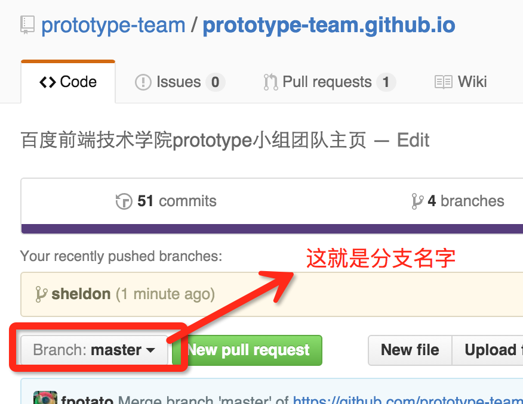

## git协作教程

### 协作是什么
首先我们要知道协作是什么？ 协作就是大家一起在同一个仓库里，做出一个完整的项目。 也就是我们所有人写的代码都放到这个仓库。比如 [prototype-team.github.io](https://github.com/prototype-team/prototype-team.github.io)这个仓库。

### 分支
但是呢，我们大家不能一起去改这个仓库，这样容易出问题。虽然我们最终要把所有代码都搞到仓库的master分支里面。但是，我们每个人各自进行开发的时候却不能在master分支上做开发。

为什么呢？ 因为master是我们最终的成果，我们不允许这个分支上有任何失误！

所以我们要各自在自己的分支上去修改，最后把大家各自改的东西合并起来，合并到master分支上。

比如我们看一下prototype-team.github.io这个仓库默认有个分支叫做 `master`.

### 协作步骤

* 在github上创建一个自己的分支，比如我Sheldon
* 去客户端，clone我们这个项目/仓库 `prototype-team.github.io`，
* 在客户端，切换到自己的分支：Sheldon
* 然后在自己的分支进行开发
* 无论是新建了文件，还是添加了代码，都需要在客户端先commit，
* commit之后，表示我做的修改已经提交到我本地的Sheldon分支了。但此时github上还没有。
* 所以，点一下客户端右上角的sync，同步到github吧。（注意，此时我是在Sheldon分支，所以我是把Sheldon分支同步到github了）
* ok，我做的东西至少在本地进行了保存，也在github上进行了保存。是吧？
* 但是你也发现了，我们最终其实是想让master上面有我的东西，但是现在我根本没去动master呀，所以master上肯定没有我的东西。 此时你着急了，，你非常急切的想让自己Sheldon分支上的内容合并到master，(也就是说把我开发的Sheldon上的东西放到master分支里去)，那么，就去看下一步：
*  很简单，只需要发一个pull request！  是不是经常听到这个词呢？ 现在亲自试试吧：
    - 先去github上切换到自己的分支，然后点击上面的new pull request，就可以发起pull request
